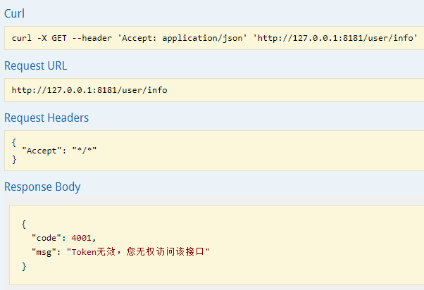
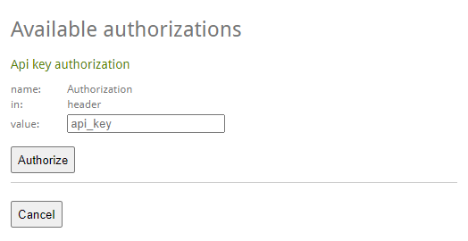
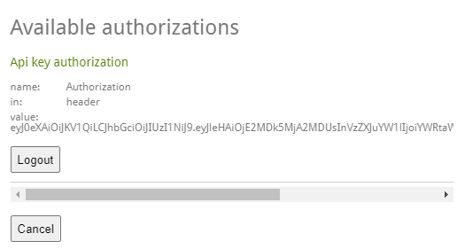
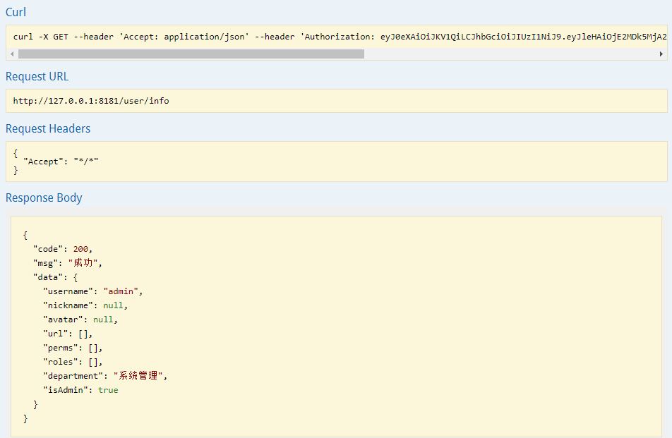

<!--more-->
## 一、现象
swagger 是一个很使用的工具，但正常使用时，我们的接口需要登陆才能访问的。即登陆时，要传一个登陆后的 token 才能访问的。
那这个怎么设置，才可以让所有接口都允许登陆后访问呢？
## 二、出现问题

## 三、解决问题
### 1）基本方法配置
```java
private List<ApiKey> securitySchemes() {
        List<ApiKey> apiKeyList = new ArrayList();
        apiKeyList.add(new ApiKey("Authorization", "Authorization", "header"));
        return apiKeyList;
    }

```

```java
  private List<SecurityContext> securityContexts() {
        List<SecurityContext> securityContexts = new ArrayList<>();
        securityContexts.add(
                SecurityContext.builder()
                        .securityReferences(defaultAuth())
                        .forPaths(PathSelectors.regex("^(?!auth).*$"))
                        .build());
        return securityContexts;
    }

    List<SecurityReference> defaultAuth() {
        AuthorizationScope authorizationScope = new AuthorizationScope("global", "accessEverything");
        AuthorizationScope[] authorizationScopes = new AuthorizationScope[1];
        authorizationScopes[0] = authorizationScope;
        List<SecurityReference> securityReferences = new ArrayList<>();
        securityReferences.add(new SecurityReference("Authorization", authorizationScopes));
        return securityReferences;
    }

```

### 2）重要配置

```java
   @Bean
    public Docket createRestApi() {
        List<Parameter> pars = new ArrayList<Parameter>();
        List<ResponseMessage> responseMessageList = new ArrayList<>();
        responseMessageList.add(new ResponseMessageBuilder().code(401).message("认证失败").build());
        responseMessageList.add(new ResponseMessageBuilder().code(1).message("请求成功").build());
        responseMessageList.add(new ResponseMessageBuilder().code(0).message("请求失败").build());
        responseMessageList.add(new ResponseMessageBuilder().code(2).message("服务器异常").build());

//        com.google.common.base.Predicate<RequestHandler> selector2 = RequestHandlerSelectors.basePackage("");
        return new Docket(DocumentationType.SWAGGER_2)
                .enable(swaggerShow)
                .globalResponseMessage(RequestMethod.POST, responseMessageList)
                .apiInfo(apiInfo()).globalOperationParameters(pars)
                .select()
                .apis(RequestHandlerSelectors.basePackage("com.dccsmart.api.controller"))
                .paths(PathSelectors.any())
                .build()
                .securitySchemes(securitySchemes())
                .securityContexts(securityContexts());
    }

```

## 四、输入token


## 五、接口测试



## 六、接口访问效果



