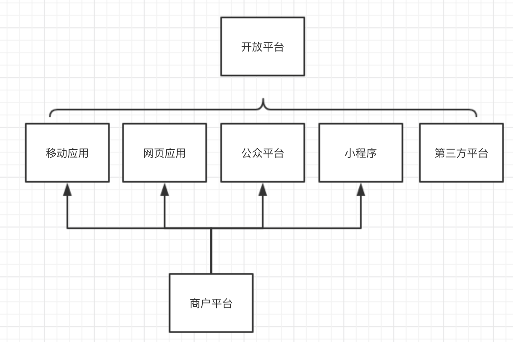
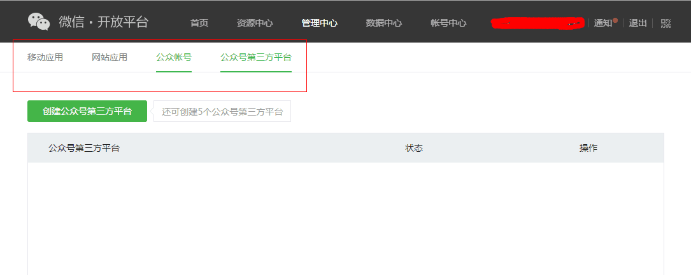
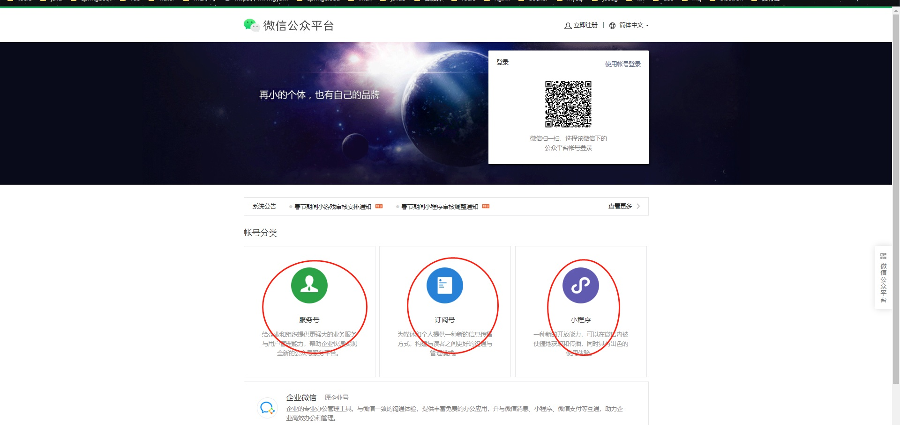
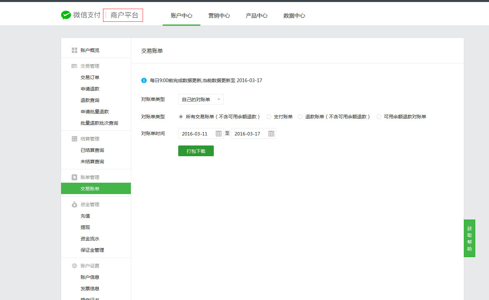
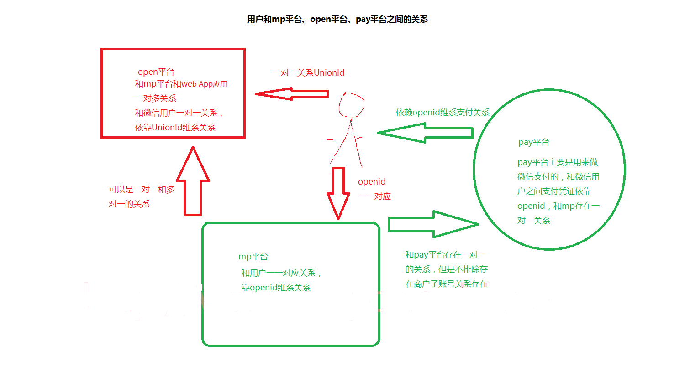

<!--more-->
## 一、微信开发相关
对微信开发得相关基础概念进行梳理和总结
## 二、主要平台
开放平台            （文档：[微信开放平台](https://developers.weixin.qq.com/doc/oplatform/Third-party_Platforms/2.0/getting_started/terminology_introduce.html)）
公众平台&小程序 （文档：[微信公众平台文档](https://developers.weixin.qq.com/doc/offiaccount/Getting_Started/Overview.html)&[微信小程序文档](https://developers.weixin.qq.com/miniprogram/dev/framework/)）
商户平台            （文档：[微信支付文档](https://pay.weixin.qq.com/wiki/doc/apiv3/index.shtml)）
### 1）微信开放平台：包含了移动应用，网站应用，公众号和小程序，第三方平台。

移动应用：在开放平台创建移动应用和app关联，为app提供微信支付、分享到微信等等功能
网站应用：使网站支持使用微信帐号来登录
公众号和小程序：在开放平台里，可以绑定公众号和小程序，绑定后会触发unionId机制，帮助不同公众号或者小程序打通用户体系。
第三方平台：代小程序和公众号调用接口，提供运营服务和行业解决方案

### 2）微信公众平台：包含订阅号、服务号、小程序
### 3）微信商户平台：主要支持微信支付，包括线上线下的支付应用场景

三者关系如下图，所有应用都属于开放平台，开放平台可以绑定小程序和公众号使它们关联起来，商户平台为所有应用提供支付功能。

以下分别介绍三大平台具体细节
## 1）微信开放平台（open.weixin.qq.com）

官方介绍：开发平台是为微信用户提供服务的平台,而公众平台开发接口则是提供服务的基础,开发者在公众平台网站中创建公众号、获取接口权限后,可以通过阅读本接口文档来帮助开发！

这里主要是开发者的领地！我们可以从官方的介绍中可以发现这个平台主要是为了开发者服务的，其中涉及移动应用、网站应用、公众号开发、公众号第三方平台等有关微信登录、支付以及相关开发文档都可以在这里找到，简直就是微信和其他第三方应用接入的接口大全，后面简称open平台！

## 2）微信公众平台（map.weixin.qq.com）

官方介绍： 微信公众平台，给个人、企业和组织提供业务服务与用户管理能力的全新服务平台。

这个平台是针对普通用户（个人）、企业、组织提供服务的，是运营和开发者的领地！这里说白了就是订阅号、服务号、企业号给我们提供的服务，而微信公众平台也是提供登录、管理和操作处理这三类账号的平台，从注册到最后的登陆、文章发布、用户管理等操作都可以在这里处理，后面简称mp平台！
## 3）微信商户平台（pay.weixin.qq.com）

官方介绍：微信支付是腾讯公司的支付业务品牌，微信支付提供**公众号支付**、**APP支付**、**扫码支付**、**刷卡支付**等支付方式。微信支付结合微信公众账号，全面打通O2O生活消费领域，提供专业的互联网+行业解决方案，微信支付支持微信红包和微信理财通，是移动支付的首选。

在这个商户平台不仅提供开发者有关的开发文档，而且提供流水记录和红包等相关的运营策略，所以这里是开发者，运营者，财务的领地！所有使用微信支付，不论是扫码支付，app支付等所有的流水订单都可以在这里找到足迹，为我们的每一笔订单提供对账凭证和查询记录，后面简称**pay平台**
## 总结平台之间得关系
公众平台（mp）、开放平台（open）、商户平台（pay）直接的关联

## Openid和UnionID之间的关系；

**openid**的唯一标识是说在我们的微信公众平台下，**一个人微信对一个微信公众平台帐号**（这里可以是**订阅号**、**服务号**、**企业号**）的微信标识，但是我们的open平台有个功能是一个开发者账号可以绑定最多10个微信公众平台账号、多个网站应用、多个移动应用，这个时候如何在一个微信开发者账号中识别10个map平台下用户的唯一性呢？这个时候UnionId就出现了，所以他的意义是可想而知的，如果在企业中既存在mp平台账号又存在web应用和移动应用的时候我们为了方便用户的管理和去用户冗余性，在整体的设计中我相信大家都会采用**UnionId**来做微信登录的唯一标识的

**商户平台和用户以及公众平台之间的关系**又是如何呢？**从简单原则上来说公众平台和商户平台之间是一一对应的关系的**，但是也存在微信开发者拥有微信支付开发权限存在微信商户子账号的存在，但是无论如何商户平台和用户之间的支付关系都是唯一的，都是用过openid来产生的，不论是红包支付还是企业支付其依赖关系都是openid；

## 用户、公众平台、开放平台、商户平台之间的关系：

