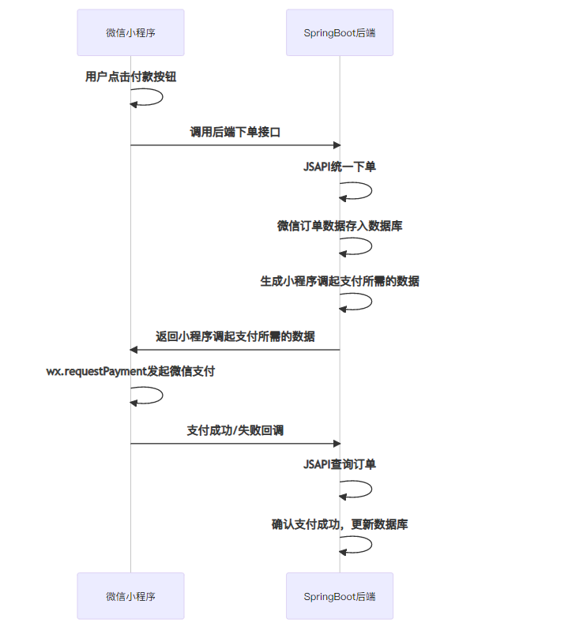

# 一、前文
- V2版本的API，通过MD5加密（本博文主要简述）
- V3版本的API，使用RAS加密
# 二、流程图

# 三、SpringBoot接口实现

## 1) 依赖
```java
        <dependency>
            <groupId>com.github.binarywang</groupId>
            <artifactId>weixin-java-pay</artifactId>
            <version>4.1.0</version>
        </dependency>
```


## 1）加签和验签
``` java

  /**
     * 检验签名
     *
     * @param signMap 请求参数
     * @param apiKey  支付平台分配apikey
     * @return
     */
    public static boolean checkSign(Map<String, Object> signMap, String apiKey) {
        //取出sign
        log.info("检验签名--->签名请求参数：{}", signMap);
        String sign = Optional.ofNullable(signMap.get("sign")).orElseThrow(() -> new CustomException("签名为空，无法验签")).toString();
        //删除map中的签名
        signMap.remove("sign");
        //排除集合内的非空参数
        Predicate<Map.Entry<String, Object>> predicateStr = x -> StringUtils.isNotBlank(x.getValue() + "");
        //参数名ASCII码从小到大排序转化成url 参数拼接的模式
        List<Object> list = signMap.entrySet().stream().filter(predicateStr)
                .sorted(Map.Entry.comparingByKey()).map(et -> et.getKey() + "=" + et.getValue()).collect(Collectors.toList());
        String stringA = StringUtils.join(list, "&");
        log.info("检验签名---->拼接第一次加签： {}", stringA);
        //拼接的密匙key
        String stringSignTemp = stringA + "&key=" + apiKey;
        log.info("检验签名---->拼接+key参数： {}", stringSignTemp);
        //MD5 加密，并且转化大写
        if (sign.equals(SecureUtil.md5(stringSignTemp).toUpperCase())) {
            return true;
        }
        return false;
    }


    /**
     * 签名
     *
     * @param signMap 请求参数
     * @param apiKey  支付平台分配apikey
     * @return
     */
    @SneakyThrows
    public static String getSign(Map<String, String> signMap, String apiKey) {
        //排除集合内的非空参数
        Predicate<Map.Entry<String, String>> predicateStr = x -> StringUtils.isNotBlank(x.getValue());
        //参数名ASCII码从小到大排序转化成url 参数拼接的模式
        List<Object> list = signMap.entrySet().stream().filter(predicateStr)
                .sorted(Map.Entry.comparingByKey()).map(et -> et.getKey() + "=" + et.getValue()).collect(Collectors.toList());
        String stringA = StringUtils.join(list, "&");
        log.info("签名--->拼接第一次加签： {}", stringA);
        //拼接的密匙key
        String stringSignTemp = stringA + "&key=" + apiKey;
        log.info("签名--->拼接+key参数： {}", stringSignTemp);
        //MD5 加密，并且转化大写
        String md5 = SecureUtil.md5(stringSignTemp).toUpperCase();
        log.info("签名--->md5加密参数： {}", md5);
        return md5;
    }

```

## 2）请求参数实体req
```java


/**
 * 微信调起支付数据 WxPayment
 *
 * @author XUEFENG
 */
@ApiModel(value="WxPayment",description="微信调起支付数据")
public class WxPayment
{


    @ApiModelProperty(value="小程序id", required = true)
    @Excel(name = "小程序id")
    private String appId;

    @ApiModelProperty(value="时间戳", required = true)
    @Excel(name = "时间戳")
    private String timeStamp;

    @ApiModelProperty(value="随机字符串", required = true)
    @Excel(name = "随机字符串")
    private String nonceStr;

    @ApiModelProperty(value="订单详情扩展字符串", required = true)
    @Excel(name = "订单详情扩展字符串")
    @JsonProperty("package")
    private String _package;

    @ApiModelProperty(value="签名方式", required = true)
    @Excel(name = "签名方式")
    private String signType;

    @ApiModelProperty(value="签名", required = true)
    @Excel(name = "签名")
    private String paySign;


    public String getAppId() {
        return appId;
    }

    public void setAppId(String appId) {
        this.appId = appId;
    }

    public String getTimeStamp() {
        return timeStamp;
    }

    public void setTimeStamp(String timeStamp) {
        this.timeStamp = timeStamp;
    }

    public String getNonceStr() {
        return nonceStr;
    }

    public void setNonceStr(String nonceStr) {
        this.nonceStr = nonceStr;
    }

    public String get_package() {
        return _package;
    }

    public void set_package(String _package) {
        this._package = _package;
    }

    public String getSignType() {
        return signType;
    }

    public void setSignType(String signType) {
        this.signType = signType;
    }

    public String getPaySign() {
        return paySign;
    }

    public void setPaySign(String paySign) {
        this.paySign = paySign;
    }

    
}

```


