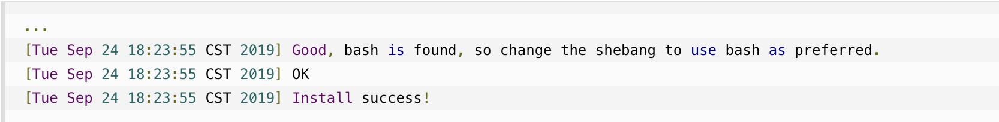
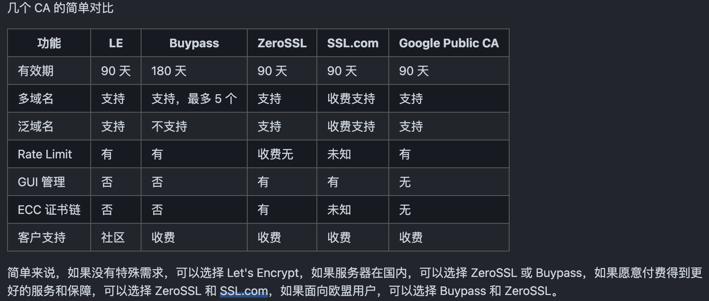
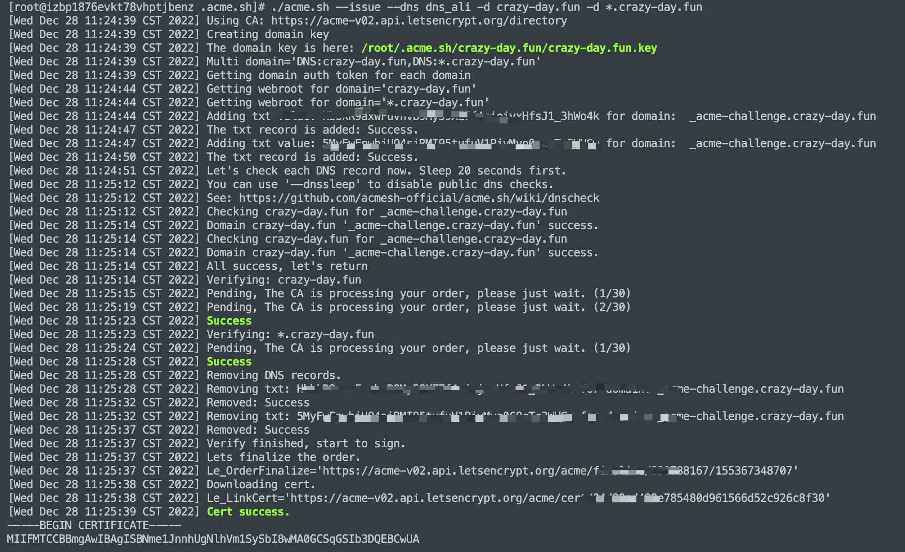
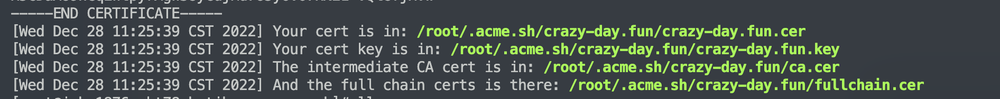
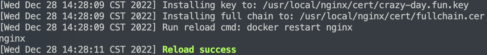
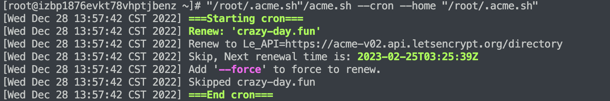

## 一、安装 acme.sh
```shell
curl https://get.acme.sh | sh -s email=username@example.com
```


<!--more-->
## 二、选择 CA
> 目前 acme.sh 支持四个正式环境 CA，分别是 Let's Encrypt、Buypass、ZeroSSL 和 SSL.com，默认使用 ZeroSSL，如果需要更换可以使用如下命令：
```shell
切换 Let's Encrypt

acme.sh --set-default-ca --server letsencrypt
切换 Buypass

acme.sh --set-default-ca --server buypass
切换 ZeroSSL

acme.sh --set-default-ca --server zerossl
切换 SSL.com

acme.sh --set-default-ca --server ssl.com
切换 Google Public CA

acme.sh --set-default-ca --server google
```

## 三、申请证书
```shell
# 替换成从阿里云后台获取的密钥
export Ali_Key="123"
export Ali_Secret="abbcddddd"
# 换成自己的域名
acme.sh --issue --dns dns_ali -d example.com -d *.example.com
```
你的证书文件已经申请成功了，并放到了 ~/.acme.sh/ 目录里面。


> TIP: 所有的 acme.sh 配置都记录在 ~/.acme.sh/ 目录里面，acme.sh 有自动的配置读取，并按域名划分，下次你再次执行的时候，它知道你之前是用的那个目录，只需要告诉它域名就好了。
## 四、安装证书
申请好证书后，需要将证书安装一下，其实就是将证书挪到类似nginx目录下，方便使用
```shell
./acme.sh --installcert -d crazy-day.fun \
> --key-file /usr/local/nginx/cert/crazy-day.fun.key \
> --fullchain-file /usr/local/nginx/cert/fullchain.cer \
> --reloadcmd "docker restart nginx"
```
安装完成：

>NOTE: 这个比较重要，因为它会让 acme.sh 记住重启 Nginx 的命令，以后自动更新证书的动作需要重启 Nginx,博主使用docker的容器中的nginx所以使用--reloadcmd "docker restart nginx"，可根据自身情况设置重启nginx命令。
nginx配置证书只需要关心crazy-day.fun.key、fullchain.cer两个文件即可。
## 五、后续维护
Let's Encrypt 的证书有效期是 90 天的，你需要定期 renew 重新申请，这部分 acme.sh 以及帮你做了，在安装的时候往 crontab 增加了一行每天执行的命令 acme.sh --cron,输入crontab -l查看定时任务。
```shell
23 0 * * * "/root/.acme.sh"/acme.sh --cron --home "/root/.acme.sh" > /dev/null
```
>PS: 下面这段你可以尝试执行一下，看看是否正确
```shell
"/root/.acme.sh"/acme.sh --cron --home "/root/.acme.sh"
```
这样就是正常的：


> acme.sh --cron 命令执行以后将会 申请新的证书 并放到相同的文件路径。由于前面执行 --installcert 的时候告知了重新 Nginx 的方法，acme.sh 也同时会在证书更新以后重启 Nginx。

